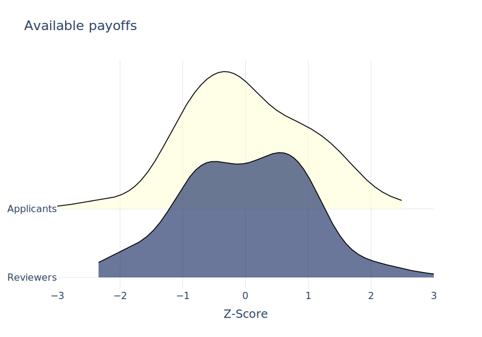
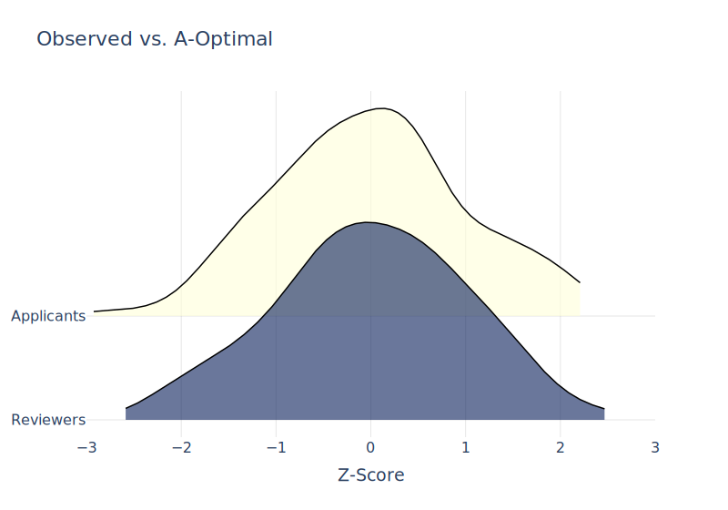
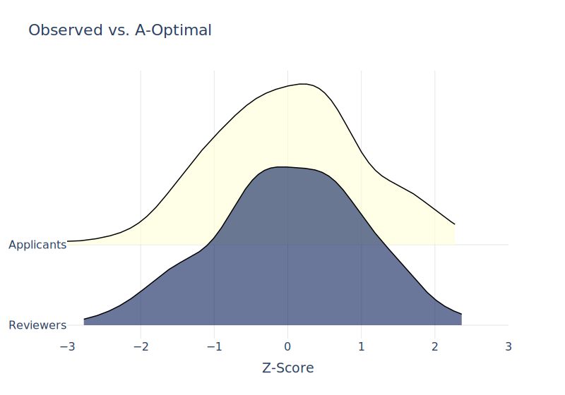
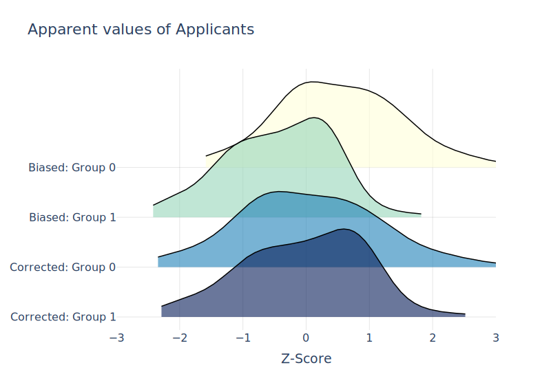
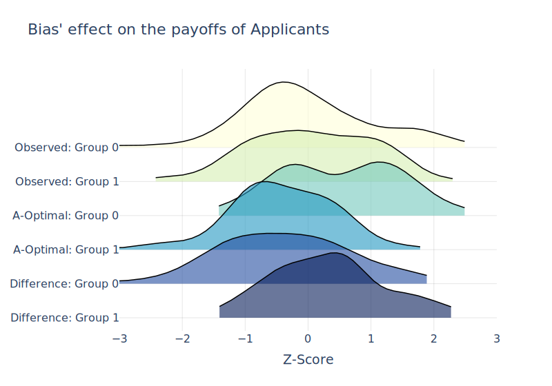

# Deferred Acceptance with Marginal Rate of Substitution

[Algorithm](#the-algorithm) | [Usage](#to-use-the-module) | [Examples](#examples) | [Functions](#functions) | [Codebook](#codebook) | [References](#references)


This module is a python implementation of the *deferred acceptance procedure (DAP)* developed by Gale and Shapley (1962). The algorithm computes an applicant-optimal assignment based on the data for the agents' characteristics and the *marginal rate of substitution (MRS)* between the characteristics of their counterparts.

*Any suggestions regarding either the code or economics are most welcome!*

## The algorithm

Suppose a set of applicants (A) and a set of reviewers (B) participate in a two-sided matching market. Assume the sets are equally sized and each reviewer can only match with one applicant and vice versa. An *A-Optimal* assignment can be achieved through the following steps:

1. Each applicant approaches their first best reviewer
2. Each reviewer tentatively accepts the most preferred applicant and rejects the rest
3. Each unmatched applicant approaches their next best reviewer
4. Each reviewer tentatively accepts the most preferred applicant and rejects the rest

... repeat until no unmatched reviewers are left, at which point the matches are finalised.

An assignment is called **A-Optimal** if all applicants are at least as well off under it as under any other *stable assignment*. 

An assignment is called **stable** if there are no two pairs of matched agents who would prefer to switch with each other.

## To use the module

1. Create a new directory with the input data make it your working directory
2. Clone the repository to that directory
3. Make sure the following packages are installed: `pandas`, `matplotlib`, `ridgeplot`, `plotly`, `kaleido`
4. Import the module:
```python
import dap_mrs
```
5. Type `help(dap_mrs)` to view the module's description or `help(dap_mrs.matching)` for the default parameters of the matching procedure
6. Specify the input parameters
7. Run the algorithm

## Examples
[Default parameters](#default-parameters) | [Biased reviewer](#biased-reviewer)

### Default parameters

Let us run the programme without specifying any parameters except the seed for reproducibility:

```python
output_data, log = dap_mrs.matching(seed=43)
```

Without input data provided the function will generate the following simulated dataset:

```python
import pandas as pd
import numpy as np

pd.DataFrame({'A_char_1': np.random.normal(50, 10, 200),
              'A_char_2': np.random.normal(50, 10, 200),
              'A_char_3': np.random.normal(50, 10, 200),
              'A_char_4': np.random.normal(50, 10, 200),
              'A_mrs12': [1.75] * 200,
              'A_mrs13': [1.25] * 200,
              'A_mrs14': [0.75] * 200,
              'B_char_1': np.random.normal(50, 10, 200),
              'B_char_2': np.random.normal(50, 10, 200),
              'B_char_3': np.random.normal(50, 10, 200),
              'B_char_4': np.random.normal(50, 10, 200),
              'B_mrs12': [1.75] * 200,
              'B_mrs13': [1.25] * 200,
              'B_mrs14': [0.75] * 200,
              'A_bias_char': np.random.binomial(1, 0.5, 200),
              'B_bias_mrs': [-25] * 200})
```

_**Note:** Although the bias characteristics are specified, the procedure will ignore them by default._

The function will return 2 data frames:
 - **output_data** — modified input data file with the matching results added as new columns
 - **log** — additional file containing information about each iteration of the algorithm
 
_**Note:** Specifying `dap_allocation_vars=True` will return the output data with the additional columns containing applicants' and reviewers' initially assigned index, the index of their applicants' A-Optimal matches (reviewers), as well as their characteristics. This can be useful if the relationship between the characteristics of the DAP-assigned agents is of interest._

and 2 graphs: 
 - **available_payoffs** - available payoffs for applicants and reviewers
  
 - **obs_vs_dap** - the difference between the payoffs of the applicants in the observed (original) and the A-Optimal (dap-computed) allocations


### Biased reviewer

Let us run a biased version of the procedure. As before, we will use the default parameters, but this time turning on the bias:

```python
output_data, log = dap_mrs.matching(bias=True, spec_name = "biased", seed=43)
```

As displayed above, the simulated data includes the applicants' binary characteristic `'A_bias_char'` and the reviewers' bias in the form of the MRS `'B_bias_mrs'`, which by default is set to -25. This suggests that every applicant with `'A_bias_char'` of 1 will appear to the reviewer as if they provide 25 units lower payoff than another applicant with the same set of characteristics but with `'A_bias_char'` of 0.

The function will return 2 data frames:
 - **output_data** — same as before but containing index of the applicants' biased-DAP-assigned matches (reviewers) and their characteristics, as well as the applicants "apparent values", i.e. potential payoffs that can be obtained from matching with the applicant as it appears to the reviewer, and their bias-corrected version.
 - **log** — same as before

 and 4 graphs:
 - **available_payoffs** - as before (not affected by the matching procedure)
  
 - **obs_vs_dap** - as before (may be different due to the change in the reviewers perception of the applicants)
 
 - **apparent_values** - the payoffs that can be obtained from matching with the applicant as they appear to the reviewers by `'A_bias_char'`
 
 - **bias_effect** - applicants' payoffs obtained in the observed (presumably unbiased) allocation, payoffs obtained in the biased DAP-produced allocation, and the difference between the two — all by `'A_bias_char'`


## Functions
**main:** [`matching`](#dap_mrsmatching)  
**graphs:** [`available_payoffs`](#dap_mrsgraphsavailable_payoffs) | [`observed_vs_dap`](#dap_mrsgraphsobserved_vs_dap) | [`apparent_values`](#dap_mrsgraphsapparent_values) | [`bias_effect`](#dap_mrsgraphsbias_effect)

### `dap_mrs.matching`

Perform the Deferred Acceptance Procedure (DAP) based on the data for the agents' characteristics and the marginal rates of substitution (MRS) between the characteristics of their counterparts.

---

_**Parameters:**_

**`data_input` : str or pd.DataFrame, optional.** 
The dataset to use for the matching process. If 'example_data', a default dataset will be generated. Default is 'example_data'.

**`A_char_number` : int, optional.**
The number of applicants' characteristics. Can take values of 2, 3, or 4. Default is 4.

**`B_char_number` : int, optional.**
The number of reviewers' characteristics. Can take values of 2, 3, or 4. Default is 4.

**`bias` : bool, optional.**
If True, the reviewers' bias will be included in the matching process. Default is False.

**`A_char_1_name` : str, optional.**
The name of the first characteristic of applicants. Default is 'A_char_1'.

**`A_char_2_name` : str, optional.**
The name of the second characteristic of applicants. Default is 'A_char_2'.

**`A_char_3_name` : str, optional.**
The name of the third characteristic of applicants. Default is 'A_char_3'.

**`A_char_4_name` : str, optional.**
The name of the fourth characteristic of applicants. Default is 'A_char_4'.

**`A_bias_char_name` : str, optional.**
The name of the applicants' binary characteristic that the reviewers have a bias towards. Default is 'A_bias_char'.

**`A_mrs12_name` : str, optional.**
The name of the applicants' marginal rate of substitution between the reviewers' first and second characteristics. Default is 'A_mrs12'.

**`A_mrs13_name` : str, optional.**
The name of the applicants' marginal rate of substitution between the reviewers' first and third characteristics. Default is 'A_mrs13'.

**`A_mrs14_name` : str, optional.**
The name of the applicants' marginal rate of substitution between the reviewers' first and fourth characteristics. Default is 'A_mrs14'.

**`B_char_1_name` : str, optional.**
The name of the first characteristic of reviewers. Default is 'B_char_1'.

**`B_char_2_name` : str, optional.**
The name of the second characteristic of reviewers. Default is 'B_char_2'.

**`B_char_3_name` : str, optional.**
The name of the third characteristic of reviewers. Default is 'B_char_3'.

**`B_char_4_name` : str, optional.**
The name of the fourth characteristic of reviewers. Default is 'B_char_4'.

**`B_mrs12_name` : str, optional.**
The name of the reviewers' marginal rate of substitution between the applicants' first and second characteristics. Default is 'B_mrs12'.

**`B_mrs13_name` : str, optional.**
The name of the reviewers' marginal rate of substitution between the applicants' first and third characteristics. Default is 'B_mrs13'.

**`B_mrs14_name` : str, optional.**
The name of the reviewers' marginal rate of substitution between the applicants' first and fourth characteristics. Default is 'B_mrs14'.

**`B_bias_mrs_name` : str, optional.**
The name of the reviewers' bias rate towards the applicants' bias characteristic. Default is 'B_bias_mrs'.

**`A_name` : str, optional.**
The label for applicants in the graphs. Default is 'Applicants'.

**`B_name` : str, optional.**
The label for reviewers in the graphs. Default is 'Reviewers'.

**`spec_name` : str, optional.**
Specification name. Used to name the output files and new variables. Default is 'default'.

**`dap_allocation_vars` : bool, optional.**
If True, in addition to the variables containing applicants' and reviewers' initially assigned indices, 
the indices of their A-Optimal matches, as well as their characteristics. Default is False.

**`graphs` : bool, optional.**
If True, the output graphs will be plotted. Default is True.

**`save_files` : bool, optional.**
If True, the output files will be saved. Default is True.

**`seed` : int, optional.**
Random seed. If None, the seed will be generated based on the current time. Default is None.

_**Returns:**_

**`data_output` : pd.DataFrame.**
The updated dataset with matching results.

**`log` : pd.DataFrame.**
The log of the matching process.

---

### `dap_mrs.graphs.available_payoffs`
----

Plot the available payoffs for the Applicants and Reviewers.

_**Parameters:**_

**`data_input` : DataFrame.**
The DataFrame containing the data.

**`spec_name` : str.**
Specification name. Used to find the relevant variables in data_input and name the graph files. Default is 'default'.

**`A_name` : str.**
The label for applicants in the graphs. Default is 'Applicants'.

**`B_name` : str.**
The label for reviewers in the graphs. Default is 'Reviewers'.

**`units` : str.**
The payoff units. Default is 'Z-Score'.

**`bins` : int or None.**
The number of bins for histogram binning or KDE if None. Default is None.

**`save_graph` : bool.**
Whether to save the graph as a file. Default is True.

**`extension` : str.**
The file extension for the saved graph. Default is 'pdf'.

_**Returns:**_

**`fig` : plotly.graph_objs._figure.Figure.**
The plotly figure object.

---
### `dap_mrs.graphs.observed_vs_dap`

Plot the observed payoffs vs. the A-Optimal payoffs for the Applicants and Reviewers.

---

_**Parameters:**_

**`data_input` : DataFrame.**
The DataFrame containing the data.

**`spec_name` : str.**
Specification name. Used to find the relevant variables in data_input and name the graph files. Default is 'default'.

**`A_name` : str.**
The label for applicants in the graphs. Default is 'Applicants'.

**`B_name` : str.**
The label for reviewers in the graphs. Default is 'Reviewers'.

**`units` : str.**
The payoff units. Default is 'Z-Score'.

**`bins` : int or None.**
The number of bins for histogram binning or KDE if None. Default is None.

**`save_graph` : bool.**
Whether to save the graph as a file. Default is True.

**`extension` : str.**
The file extension for the saved graph. Default is 'pdf'.

_**Returns:**_

**`fig` : plotly.graph_objs._figure.Figure.**
The plotly figure object.

---
### `dap_mrs.graphs.apparent_values`

Plot the Applicants' apparent values for the two groups of agents defined by the bias characteristic.

---

_**Parameters:**_

**`data_input` : DataFrame.**
The DataFrame containing the data.

**`spec_name` : str.**
Specification name. Used to find the relevant variables in data_input and name the graph files. Default is 'default'.

**`A_name` : str.**
The label for applicants in the graphs. Default is 'Applicants'.

**`A_bias_char_name` : str.**
The name of the applicants' binary characteristic that the reviewers have a bias towards. Default is 'A_bias_char'.

**`units` : str.**
The payoff units. Default is 'Z-Score'.

**`bins` : int or None.**
The number of bins for histogram binning or KDE if None. Default is None.

**`save_graph` : bool.**
Whether to save the graph as a file. Default is True.

**`extension` : str.**
The file extension for the saved graph. Default is 'pdf'.

_**Returns:**_

**`fig` : plotly.graph_objs._figure.Figure.**
The plotly figure object.

---
### `dap_mrs.graphs.bias_effect`

Plot the bias' effect onA the payoffs of the Applicants for the two groups of agents defined by the bias characteristic.

---

_**Parameters:**_

**`data_input` : DataFrame.**
The DataFrame containing the data.

**`spec_name` : str.**
Specification name. Used to find the relevant variables in data_input and name the graph files. Default is 'default'.

**`A_name` : str.**
The label for applicants in the graphs. Default is 'Applicants'.

**`A_bias_char_name` : str.**
The name of the applicants' binary characteristic that the reviewers have a bias towards. Default is 'A_bias_char'.

**`units` : str.**
The payoff units. Default is 'Z-Score'.

**`bins` : int or None.**
The number of bins for histogram binning or KDE if None. Default is None.

**`save_graph` : bool.**
Whether to save the graph as a file. Default is True.

**`extension` : str.**
The file extension for the saved graph. Default is 'pdf'.

_**Returns:**_

**`fig` : plotly.graph_objs._figure.Figure.**
The plotly figure object.

## Codebook
[Output data](#output-data) | [Log](#log)

### Output data

| **Variable Name**         | **Description**                                                                                     | **Condition**                     |
|---------------------------|-----------------------------------------------------------------------------------------------------|-------------------------------------------|
| `[spec_name]_initial_index`         | The original index of A and B in the input dataset `data_input` | `dap_allocation_vars=True` or `bias=True`  |
| `[spec_name]_dap_jobid`             | The index of B matched with A as the result of the DAP  | `dap_allocation_vars=True` |
| `[spec_name]_dap_[B_char_1_name]`   | The first characteristic of B matched with A as the result of the DAP | `dap_allocation_vars=True` |
| `[spec_name]_dap_[B_char_2_name]`   | The second characteristic of B matched with A as the result of the DAP | `dap_allocation_vars=True` |
| `[spec_name]_dap_[B_char_3_name]`   | The third characteristic of B matched with A as the result of the DAP | `dap_allocation_vars=True` |
| `[spec_name]_dap_[B_char_4_name]`   | The fourth characteristic of B matched with A as the result of the DAP | `dap_allocation_vars=True` |
| `[spec_name]_A_obs_u`               | A's payoff in the observed allocation | default |
| `[spec_name]_B_obs_u`               | B's payoff in the observed allocation | default |
| `[spec_name]_A_dap_u`               | A's payoff in the DAP-derived allocation | default |
| `[spec_name]_B_dap_u`               | B's payoff in the DAP-derived allocation | default |
| `[spec_name]_bidap_jobid`           | The index of B matched with A as the result of the biased DAP  | `bias=True` |
| `[spec_name]_bidap_[B_char_1_name]` | The first characteristic of B matched with A as the result of the biased DAP | `bias=True` |
| `[spec_name]_bidap_[B_char_2_name]` | The second characteristic of B matched with A as the result of the biased DAP | `bias=True` |
| `[spec_name]_bidap_[B_char_3_name]` | The third characteristic of B matched with A as the result of the biased DAP | `bias=True` |
| `[spec_name]_bidap_[B_char_4_name]` | The fourth characteristic of B matched with A as the result of the biased DAP | `bias=True` |
| `[spec_name]_A_apparent_v`         | the payoff that can be obtained from matching with A as it appears to B | `bias=True` |
| `[spec_name]_A_bias_corrected_v`   | the payoff that can be obtained from matching with A as it appears to B, corrected for the bias | `bias=True` |
| `[spec_name]_A_obs_u_z`            | Z-score of A's payoff in the observed allocation | default |
| `[spec_name]_B_obs_u_z`            | Z-score of B's payoff in the observed allocation | default |
| `[spec_name]_A_dap_u_z`            | Z-score of A's payoff in the DAP-derived allocation | default |
| `[spec_name]_B_dap_u_z`            | Z-score of B's payoff in the DAP-derived allocation | default |
| `[spec_name]_diff_A`               | Difference between A's payoff in the observed allocation and the DAP-derived allocations | default |
| `[spec_name]_diff_B`               | Difference between B's payoff in the observed allocation and the DAP-derived allocations | default |
| `[spec_name]_diff_A_z`             | Z-score of the difference between A's payoffs in the observed and DAP-derived allocations | default |
| `[spec_name]_diff_B_z`             | Z-score of the difference between B's payoffs in the observed and DAP-derived allocations | default |
| `[spec_name]_A_apparent_v_z`       | Z-score of the payoff that can be obtained from matching with A as it appears to B | `bias=True` |
| `[spec_name]_A_bias_corrected_v_z` | Z-score of the payoff that can be obtained from matching with A as it appears to B, corrected for the bias | `bias=True` |

### Log

| **Variable Name**           | **Description**                                                                                                   | **Source Components**               |
|-----------------------------|-------------------------------------------------------------------------------------------------------------------|-------------------------------------|
| `iterat`                    | The current iteration number                                                        | itself                            |
| `A_match_count`             | The total number of matched As | `A['match']` |
| `A_unmatch_count`           | The total number of unmatched As | `A['match']`           |
| `B_match_count`             | The total number of matched Bs | `B['match']` |
| `B_unmatch_count`           | The total number of unmatched Bs | `B['match']`           |
| `A_match_utlity_mean`       | The average payoffs of As | `A['match_u']`         |
| `B_match_utlity_mean`       | The average payoffs of Bs | `B['match_u']`         |
| `breakups_count`            | The total number of breakups recorded during the iteration | itself                    |
| `q_reset_count`             | The total number of resets performed on the preference rank during the iteration                          | itself                     |
| `rejections_count`          | The total number of rejections recorded during the iteration                                                  | itself                  |
| `pass_matched_count`        | The total number of matched As that did not need to apply this iteration | itself |

## References

- David Gale and Lloyd S Shapley. College admissions and the stability of marriage. The American Mathematical Monthly, 69(1):9–15, 1962.
