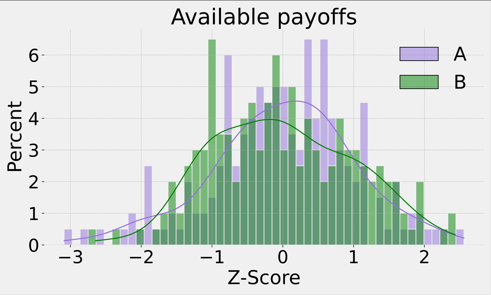
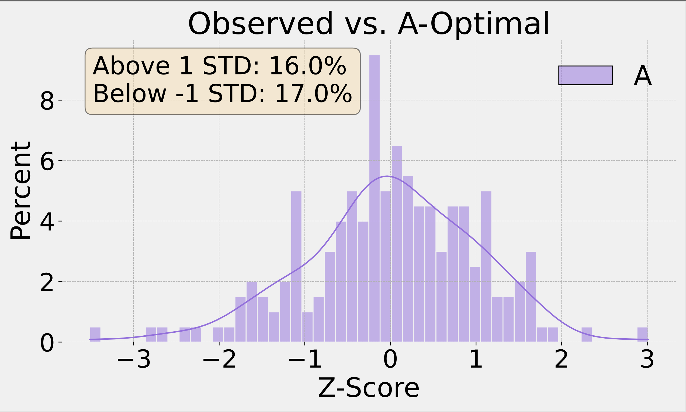

# Deferred Acceptance with Marginal Rate of Substitution

[Algorithm](#the-algorithm) | [Usage](#to-use-the-module) | [Codebook](#codebook) | [References](#references)


This module is a python implementation of the *deferred acceptance procedure (DAP)* developed by Gale and Shapley (1962). The algorithm computes an applicant-optimal assignment based on the data for the agents' characteristics and the *marginal rate of substitution (MRS)* between the characteristics of their counterparts.

*Any suggestions regarding either the code or economics are most welcome!*

## The algorithm

Suppose a set of applicants (A) and a set of reviewers (B) participate in a two-sided matching market. Assume the sets are equally sized and each reviewer can only match with one applicant and vice versa. An *A-Optimal* assignment can be achieved through the following steps:

1. Each applicant approaches their first best reviewer
2. Each reviewer tentatively accepts the most preferred applicant and rejects the rest
3. Each unmatched applicant approaches their next best reviewer
4. Each reviewer tentatively accepts the most preferred applicant and rejects the rest

... repeat until no unmatched reviewers are left, at which point the matches are finalised.

An assignment is called **A-Optimal** if all applicants are at least as well off under it as under any other *stable assignment*. 

An assignment is called **stable** if there are no two pairs of matched agents who would prefer to switch with each other.

## To use the module

1. Create a new directory with the input data make it your working directory
2. Clone the repository to that directory
3. Make sure the following packages are installed: ``pandas``, ``matplotlib``, ``seaborn``
4. Import the module:
```python
import dap_mrs
```
5. Type ``help(dap_mrs)`` to view the module's description or ``help(dap_mrs.two_features)`` for the default parameters
6. Specify the input parameters
7. Run the algorithm
```python
data_output, log = dap_mrs.two_features(data_input=my_dataframe, 
                                        A_char_1_name = 'A_char_1',
                                        A_char_2_name = 'A_char_2',
                                        A_mrs_name = 'A_mrs',
                                        B_char_1_name = 'B_char_1',
                                        B_char_2_name = 'B_char_2',
                                        B_mrs_name = 'B_mrs',
                                        A_name='A',
                                        B_name='B',
                                        files_name='dap_mrs_two_features')
```
If no input parameters are specified, the function runs the algorithm on simulated data:
```python
data_output, log = dap_mrs.two_features()
```


This produces 2 data frames and 2 graphs:
 - **data_output** — modified input data file with the matching results added as new columns
 - **log** — additional file containing information about each iteration of the algorithm
 - **available_payoffs** - available payoffs for applicants and reviewers
 - **obs_vs_dap** - difference between the payoffs of the applicants in the observed (original) and the A-Optimal (dap-computed) allocations

 

## Codebook

| **Variable Name**         | **Description**                                                                                     | **Source Components**                     |
|----------------------------|-----------------------------------------------------------------------------------------------------|-------------------------------------------|
| `initial_index`           | The original index of A and B in the input dataset `data_input`.                                             | `data_input.index`                        |
| `A_observed_utility`      | Observed utility for **A**, calculated as `B['char_1']` + `B['char_2']` * `A['mrs']`. | `B['char_1']`, `B['char_2']`, `A['mrs']` |
| `A_dap_match`             | The index of B that is matched with  status for entity **A**.                                                                 | `A['match']`                              |
| `A_dap_utility`           | The utility derived from the match for entity **A**.                                               | `A['match_utility']`                      |
| `B_observed_utility`      | Observed utility for entity **B**, calculated as the sum of `A['char_1']` and the product of `A['char_2']` and `B['mrs']`. | `A['char_1']`, `A['char_2']`, `B['mrs']` |
| `B_dap_match`             | The match status for entity **B**.                                                                 | `B['match']`                              |
| `B_dap_utility`           | The utility derived from the match for entity **B**.                                               | `B['match_utility']`                      |
| `A_observed_utility_z`    | Z-score of the observed utility for entity **A**, normalized using its mean and standard deviation. | `A_observed_utility`                                      |
| `B_observed_utility_z`    | Z-score of the observed utility for entity **B**, normalized using its mean and standard deviation. | `B_observed_utility`                                      |
| `A_dap_utility_z`         | Z-score of the match utility for entity **A**, normalized using its mean and standard deviation.    | `A_dap_utility`                                           |
| `B_dap_utility_z`         | Z-score of the match utility for entity **B**, normalized using its mean and standard deviation.    | `B_dap_utility`                                           |
| `diff_A`                  | The difference between the observed utility and the match utility for entity **A**.                                 | `A_observed_utility`, `A_dap_utility`                    |
| `diff_B`                  | The difference between the observed utility and the match utility for entity **B**.                                 | `B_observed_utility`, `B_dap_utility`                    |
| `diff_A_z`                | Z-score (standardized value) of `diff_A`, normalized using its mean and standard deviation.                          | `diff_A`                                                 |
| `diff_B_z`                | Z-score (standardized value) of `diff_B`, normalized using its mean and standard deviation.                          | `diff_B`                                                 |


## References

- David Gale and Lloyd S Shapley. College admissions and the stability of marriage. The American Mathematical Monthly, 69(1):9–15, 1962.
